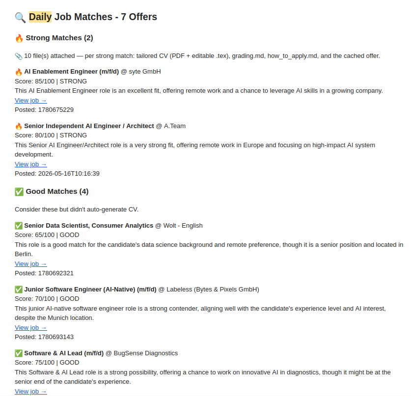
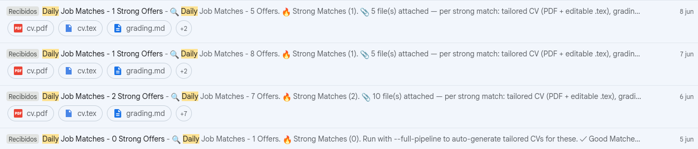

# Automated CV Pipeline

An LLM-driven toolkit for a faster, more honest job hunt. It does two things:

1. **Finds & grades jobs** — a Python pipeline scrapes postings, scores each one
   against your profile with an LLM, and emails you a daily digest of the matches.
2. **Tailors your CV** — a set of prompts drive *any* LLM assistant (Claude Code,
   Cursor, Copilot, ChatGPT…) to write a job-specific CV, a grading scorecard, and
   an application strategy — using **only facts from your `data/`**, never invented ones.

> <small>⚠️ This is a sanitized, public template. The example candidate **"Jane Doe"** is fictional. Copy `data.example/` to `data/` and put your own information in.</small>

---

## Demo

Each morning the pipeline emails a digest of graded matches. **Strong** matches arrive
with a tailored CV (PDF + editable `.tex`), a grading scorecard, and an application
strategy attached.

https://github.com/user-attachments/assets/5e7d043a-54f8-48b1-9529-429a05a5e5d3


**The daily digest email** — strong/good matches with scores and attachments:



**A few days of digests in the inbox:**



Want to see the actual generated files (CV, scorecard, how-to-apply) for a job? A complete
**fictional** example is in [`examples/output_northwind_ml_engineer/`](examples/output_northwind_ml_engineer/).

---

## The two halves

```
                ┌─────────────────────────────┐
  Daily cron ──►│  scripts/daily_job_pipeline │
                │  scrape → grade → email      │   ← Python + Gemini
                └─────────────────────────────┘
                              │ interesting offer
                              ▼
   job offer + data/ + prompts/agent_guide.md
                              │                     ← any LLM assistant
                              ▼
   outputs/<job>/  cv.tex · grading.md · how_to_apply.md
```

### A. Job search & grading (Python)
- [`src/sources/`](src/sources/) — pluggable job sources, merged + de-duplicated:
  **Moovijob** (LU), **Arbeitnow** (EU+remote), **Remotive** (remote), and
  **Google Jobs** (via SerpAPI, optional). Adding one is a single small file.
- [`src/`](src/) — Gemini-based grader, CV generator, config loader, Gmail sender.
- [`scripts/daily_job_pipeline.py`](scripts/daily_job_pipeline.py) — search → grade →
  (optionally) auto-build tailored CVs for strong matches → email digest with PDFs attached.
- Configure via `config/job_preferences.md`; schedule it to run each morning.

### B. CV tailoring (prompts + LaTeX)
- [`prompts/`](prompts/) — the core IP. Agent guides for building, grading, and
  applying. **Hard rule: the model may only use facts present in `data/`.**
- [`templates/latex/`](templates/latex/) — ready CV templates (single-column article,
  two-column AltaCV). **Switch or add a template** (incl. mAltaCV) in one config line —
  see [`docs/templates.md`](docs/templates.md).
- [`data.example/`](data.example/) — fill-in-the-blank personal data (with a worked
  "Jane Doe" example).

See [`examples/output_northwind_ml_engineer/`](examples/output_northwind_ml_engineer/)
for a complete generated set from one offer.

---

## Quickstart

```bash
# 1. Install
python -m venv venv && source venv/bin/activate
pip install -r requirements.txt

# 2. Your private data (both are git-ignored)
cp -r data.example data
cp config/job_preferences.example.md config/job_preferences.md
cp .env.example .env.local          # then fill in keys — see SETUP.md

# 3a. Tailor a CV with your LLM assistant (see docs/using-with-any-llm.md)
#     e.g. in Claude Code:
#     "Use prompts/agent_guide.md to build a CV for examples/job_offer.md from data/"

# 3b. Or run the daily job pipeline
python scripts/daily_job_pipeline.py --dry-run
```

## Run it daily for free (GitHub Actions)

A workflow ([`.github/workflows/daily-jobs.yml`](.github/workflows/daily-jobs.yml)) runs the
scrape → grade → email digest on GitHub's servers at no cost. The daily **schedule ships
disabled** so a fresh clone never fails before it's configured — add three repo Secrets and
uncomment the `schedule:` block to turn it on (you can also trigger it by hand anytime from
the Actions tab). Full guide (incl. why to use a **private** repo for your data):
[`docs/github-actions-setup.md`](docs/github-actions-setup.md).

## Use with any LLM

The CV builder works with Claude Code, Cursor, Copilot, or plain ChatGPT/Claude.ai.
Per-tool instructions: [`docs/using-with-any-llm.md`](docs/using-with-any-llm.md).

## What you need to provide

| Thing | Where | Notes |
|---|---|---|
| Your CV facts | `data/` | Copy from `data.example/`; git-ignored |
| Search preferences | `config/job_preferences.md` | Copy from the `.example` |
| API keys | `.env.local` | Gmail App Password + Gemini; see [`SETUP.md`](SETUP.md) |

## Privacy

`data/`, `config/job_preferences.md`, `.env.local`, and `outputs/` are **git-ignored**.
Keep your real information out of any public fork. The repo ships only fictional
example data.

## License

MIT — see [`LICENSE`](LICENSE).
